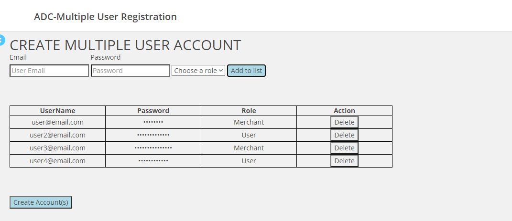
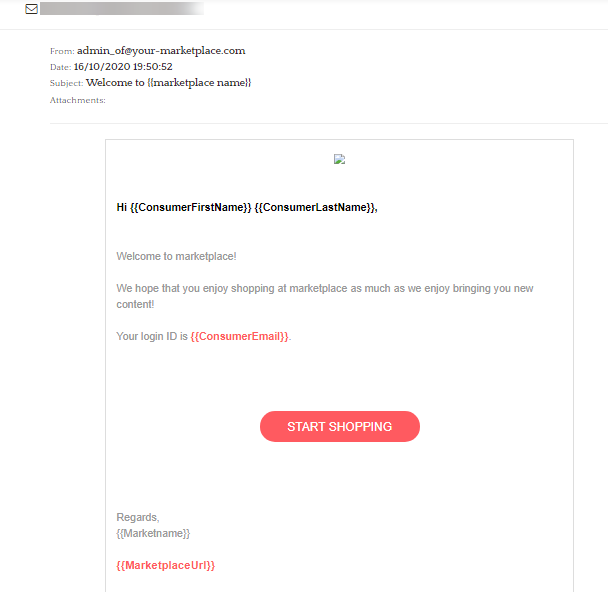

# Multiple User Accounts creation
Plug-in that enable the creation of multiple user accounts with Merchant or User Roles. Also is a notification send to the corresponding user(s).

# File structure
The file structure of each Plug-in's source code:

>
    ├── admin                    
        ├── html
        ├── css
        └── scripts                
    ├── user                   
        ├── html
        ├── css
        └── scripts 

> admin folder contains the part of the code that executes for the marketplace administrator. 

> user folder has the code that executes for the merchants and buyers.

# How to install
1. Download repository.
2. Compress (.zip) the admin and user folder. 
3. Login to Arcadier Plug-in Developer Dashboard.
4. Create a new Plug-in.
5. Upload .zip file in the created Plug-in.
6. Login into your marketplace admin portal.
7. Go to Plug-in
8. Search for the Plug-in and install it.

 
 

Email Notification Template

Version 1.0.0